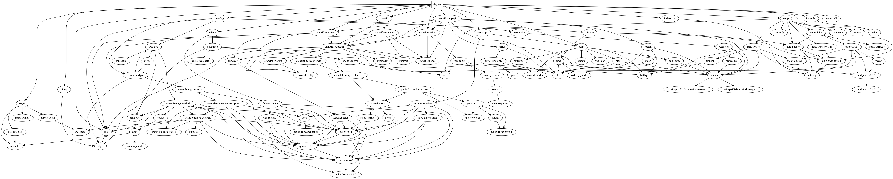

# Chigusa


Chigusa is a C0 to O0 compiler written in Rust. This compiler is a homework of the _Compilation Principle_ class in BUAA.

[中文 Readme 和设计说明](./docs)

## Progress

- [x] Tokenizer
- [x] Parser
- [x] Code generator
- [x] CLI

## About C0

C0 is a subset of C programming language used in the specification of this homework. A description of the grammar used in this project can be found [here][c0_grammar_info]. O0 is the corresponding binary file format also specified in this homework.

The official C0 and O0 format standards (Chinese):

- C0 spec & homework description: https://github.com/BUAA-SE-Compiling/c0-handbook
- O0 spec: https://github.com/BUAA-SE-Compiling/c0-vm-standards
- O0 virtual machine: https://github.com/BUAA-SE-Compiling/c0-vm-cpp

## Usage

```sh
# Parse and compile a c0 source file to `out` as c0 binary
$ chigusa <file> -o <output_file>

# Compile the file as c0 assembly
$ chigusa <file> -s -o <output_file>
# or
$ chigusa <file> --emit s0 -o <output_file>
```

## Chigusa's implementation

Chigusa uses a handwritten recursive-descending parser to parse C0 programs.

## License

Chigusa is licensed under MIT license.

(c) 2018-2019 Rynco Maekawa

## Documentation

For more documentation and Chinese readme, see [docs](./docs).

## Dependencies



## Naming

Chigusa (Fukazawa Chigusa) is a character from the anime _Iroduku: The World In Colors_. ~~Finally an anime boy gets on the list!~~

[c0_grammar_info]: docs/c0_grammar.txt
